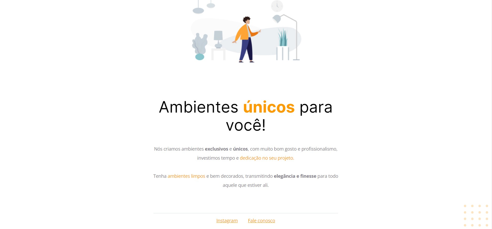

# Moveis customizados 🏠

> Trilha explorer rocketseat - #1

Este é o primeiro projeto do stage 2 da trilha, enquanto estavamos aprendendo, também estavamos elaborando este projeto juntamente com a ferramenta do figma para visualizar o layout. 

[Link para viusalizar o projeto](https://ericodesenvolvedor.github.io/moveis-customizados/)

## 💻 Tecnologias abordadas: 

- HTML
- CSS
- Figma